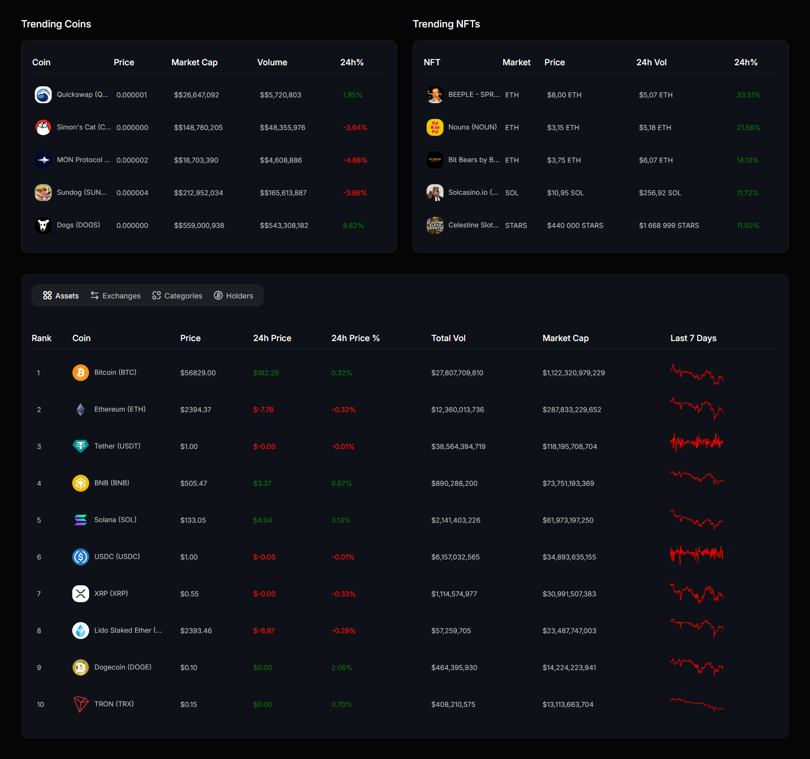
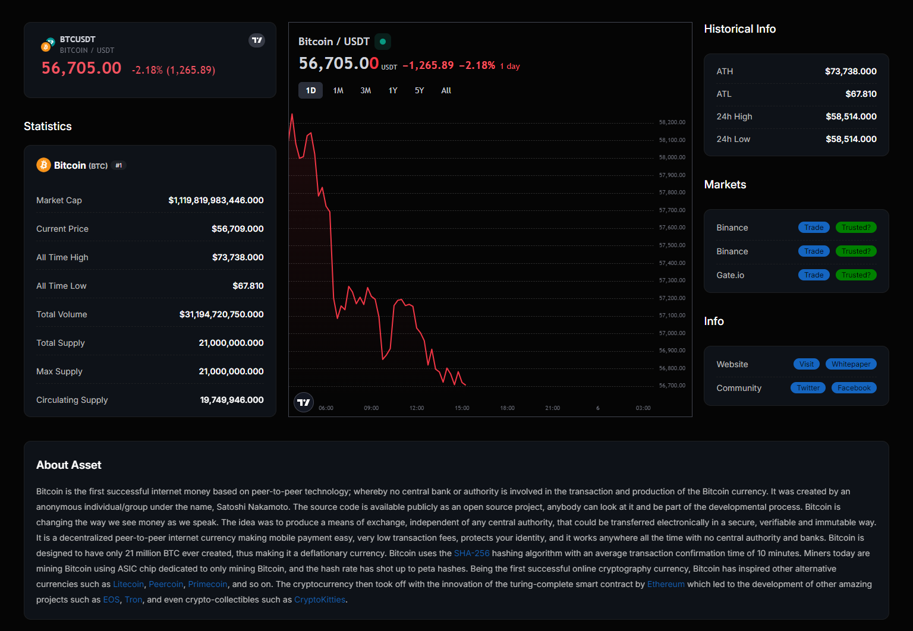
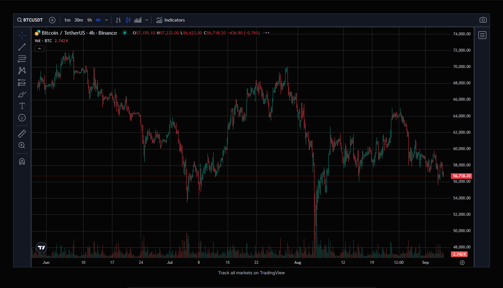
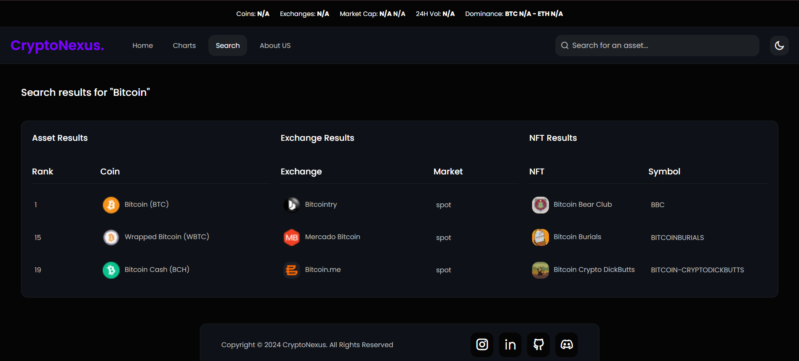
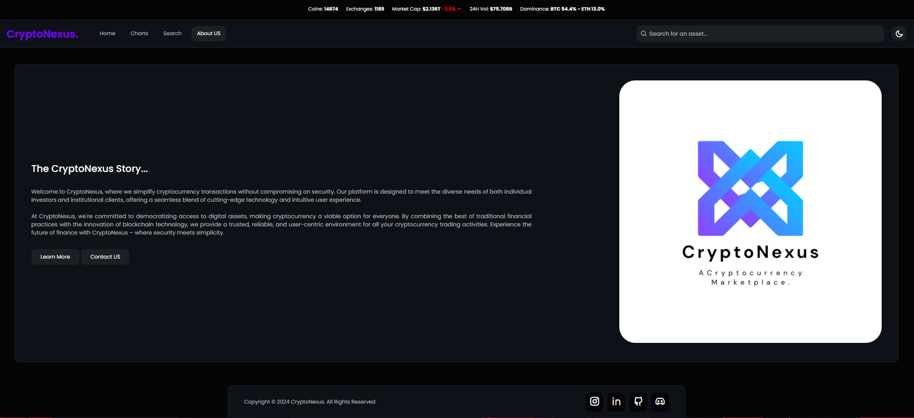
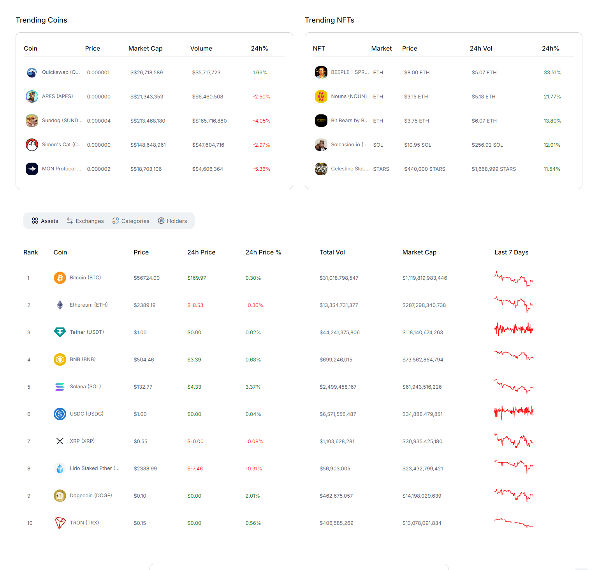
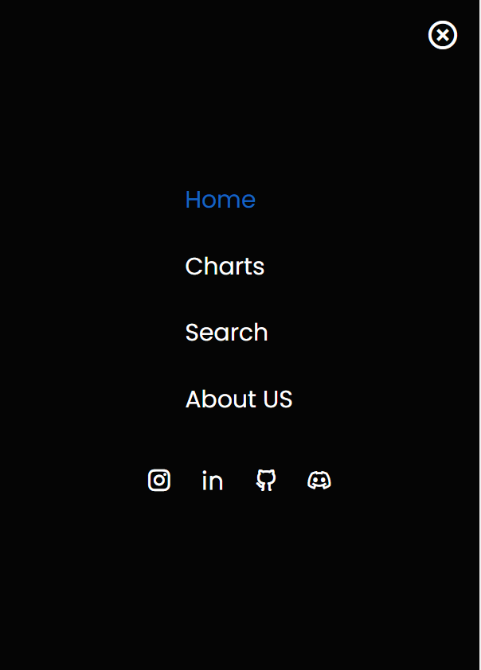

# CryptroNexus

Welcome to **CryptroNexus**, a sleek and responsive frontend web application that provides users with real-time cryptocurrency data, market trends, and comparison tools, built using **HTML**, **CSS**, and **JavaScript**.

## 💡 Key Features

- **Real-Time Price Data:** Get the latest market data for various cryptocurrencies.
- **Price Comparison:** Analyze and compare performance across multiple coins.
- **Historical Data Visualization:** View historical price data with interactive charts.
- **Responsive Design:** Optimized for both desktop and mobile devices.
- **User-Friendly Interface:** Simple, modern design for easy navigation.

---
## 🌐 Live View

Check out the live version of **CryptroNexus** here: [CryptroNexus Live](https://cryptonexus-sumandey.netlify.app/)
---

## 🛠️ Tech Stack

### **Frontend:**
- **HTML**
- **CSS**
- **JavaScript**

### **Design:**
- **Canva**
- **Adobe Express**

---

## 🚀 Getting Started

### Prerequisites

Before you begin, ensure you have the following installed:
- **VS Code** or any code editor of your choice.

### Installation

1. **Clone the repository:**

    ```bash
    git clone https://github.com/sumandey7684/CryptroNexus.git
    ```

2. **Open the project:**
    - Navigate to the project directory and open it in **VS Code**.

---

## 🔧 API Used

- **[CoinGecko API](https://www.coingecko.com/en/api):** Provides real-time cryptocurrency price data, market trends, and historical information.

---

## 🖼️ Screenshots

- Here we have project screenshot :

**Main Page**


**Coin Page**


**Charts Page**


**Search Page**


**About Page**


**Light Mode (For All Pages)**



**Also Mobile Menu**


---

## 🚧 Features in Progress

- **User Authentication:** Implement secure login and signup functionality to personalize user experience.
- **Real-Time Chat Support:** Enable live chat for users to discuss market trends and insights.
- **Advanced Filtering:** Introduce more filters for cryptocurrencies based on volume, market cap, and percentage changes.
- **Price Alerts:** Allow users to set up notifications when a cryptocurrency reaches a certain price point.


## 🤝 Collaborate

Contributions are welcome! If you'd like to collaborate:

1. Fork the project.
2. Create your feature branch (`git checkout -b feature/your-feature`).
3. Commit your changes (`git commit -m 'Add your feature'`).
4. Push to the branch (`git push origin feature/your-feature`).
5. Open a pull request.

---

## 💬 Feedback

Your feedback is important! If you encounter any issues or have suggestions for improvements, feel free to:

- Open an issue [here](https://github.com/sumandey7684/CryptroNexus/issues).
- Drop me an email or reach out through my social media platforms.

---

## 📞 Contact

Connect with me on social media:

- **LinkedIn:** [Suman's LinkedIn](https://www.linkedin.com/in/suman-dey-964612282/)
- **GitHub:** [Suman's GitHub](https://github.com/sumandey7684)
- **Instagram:** [Suman's Instagram](https://www.instagram.com/ft.sumandey/)

Feel free to reach out for any feedback, suggestions, or collaboration opportunities!

---

## 📄 License

This project is licensed under the MIT License - see the [LICENSE](LICENSE) file for details.
